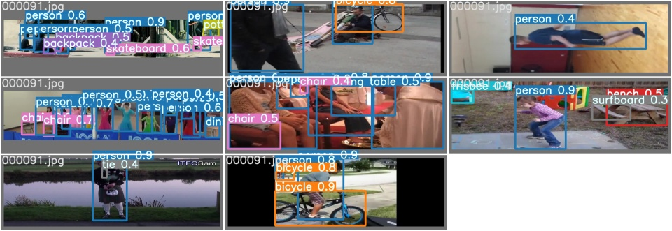

# YoloV4-large

It is copy `large` branch of [ScaledYoloV4](https://github.com/WongKinYiu/ScaledYOLOv4/tree/yolov4-large). 

We use it here to generate person detection on AVA and Kinetics dataset.

For that purpose, we modified `test.py`.

Ground Truth

Detections